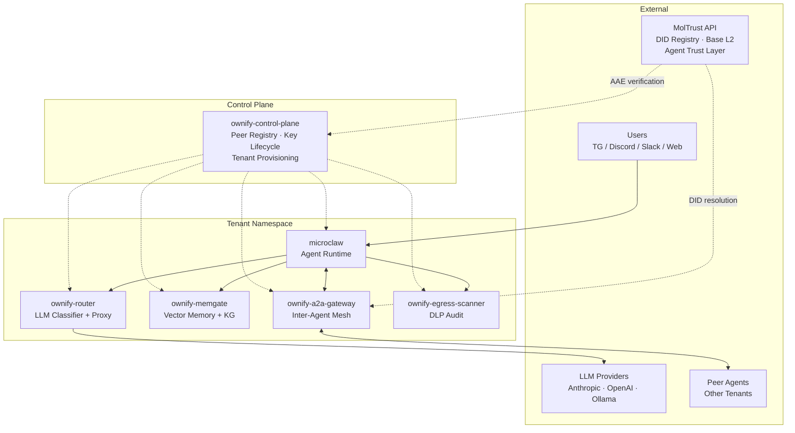
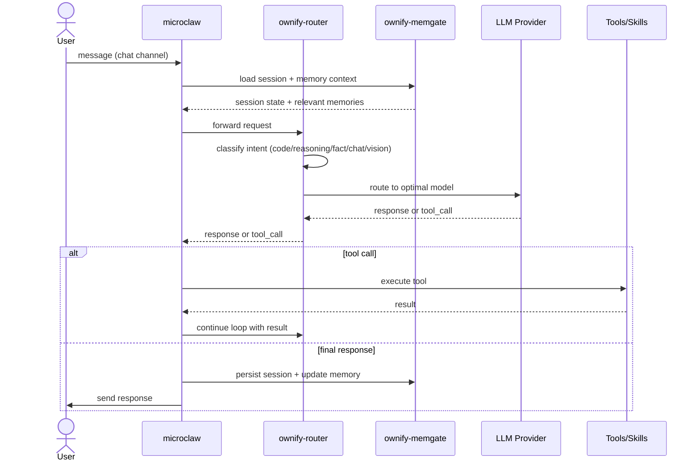

# ownify MicroClaw

[](https://github.com/HaraldeRoessler/ownify-microclaw/actions)
[](LICENSE)
[](https://github.com/HaraldeRoessler/ownify-microclaw/pkgs/container/ownify-microclaw)
[](https://moltrust.ch)

## About

**ownify** is a self-hosted, multi-tenant Kubernetes platform for running AI agents at scale. Born from the belief that powerful agent infrastructure should be open-source, transparent, and under your control. No vendor lock-in, no hidden pricing tiers — just production-grade agent hosting you own end-to-end.

ownify MicroClaw is the agent runtime that powers every ownify tenant. Built on [MicroClaw](https://microclaw.ai) — the leading Rust multi-channel agent runtime (MIT) — it extends the upstream with enterprise-grade isolation, intelligent routing, durable memory, agent-to-agent mesh networking, and data-loss prevention. Agent identity and inter-agent trust are backed by the [MolTrust Protocol](https://moltrust.ch) ([MoltyCel/moltrust-api](https://github.com/MoltyCel/moltrust-api)) — W3C DIDs, Ed25519-signed AAE envelopes, and on-chain public key anchoring on Base L2. The result is a battle-tested stack that runs thousands of agents across Telegram, Discord, Slack, Matrix, and the Web, each in their own sandboxed environment with full tool and memory access.

### Key principles

- **Multi-tenant by design** — every agent runs in dedicated Kubernetes pods with no shared state
- **Provider-agnostic** — Anthropic and OpenAI-compatible, routed per-request by intent classification
- **Memory-first** — semantic search, knowledge graph, automatic compaction — agents never forget
- **Secure from day one** — MolTrust-backed AAE-signed inter-agent envelopes, per-caller ACLs, egress DLP scanning
- **Self-hosted, open-source** — deploy on your own infrastructure with full observability

## Platform architecture



## Request lifecycle



## Repository structure

```
ownify-microclaw/
    microclaw.config.example.yaml  # Reference config
    Dockerfile                     # Multi-stage Rust + Node build
    crates/                        # Modular Rust crates
        microclaw-core/            #   Shared error/types/text
        microclaw-storage/         #   SQLite DB + memory + usage
        microclaw-tools/           #   Tool primitives + sandbox
        microclaw-channels/        #   Channel abstraction layer
        microclaw-app/             #   Logging, skills, transcribe
    src/                           # Binary source
        main.rs                    #   CLI entry (start, setup, acp)
        runtime.rs                 #   AppState wiring, channel boot
        agent_engine.rs            #   Channel-agnostic agent loop
        llm.rs                     #   Provider abstraction layer
        web.rs                     #   Web API + stream endpoints
        scheduler.rs               #   Cron scheduler + reflector
        channels/                  #   Telegram, Discord, Slack, Feishu, IRC
        tools/                     #   Bash, files, web, memory, sub-agents
        hooks.rs                   #   Before/after LLM/tool hook runtime
        egress_scan.rs             #   ownify DLP client
    skills/                        # Built-in agent skills
        built-in/
            ownify-memory-enhanced/  # Memory protocol
            a2a-self-log/            # A2A interaction logging
            autonomous-coder/        # Autonomous coding workflow
            docx/ pdf/ pptx/ xlsx/   # Document skills (Marp for pptx)
            github/ sendgrid/ imap-mail/
    docs/                          # Operations, releases, RFCs
    web/                           # React web UI (embedded in binary)
    hooks/                         # Sample hooks
    scripts/                       # CI helpers, OVH build script
```

## MolTrust trust infrastructure

[**MolTrust**](https://moltrust.ch) ([github.com/MoltyCel/moltrust-api](https://github.com/MoltyCel/moltrust-api)) provides the agent identity and trust layer for ownify's A2A mesh. Every inter-agent message carries an Agent Authorization Envelope (AAE) — an Ed25519-signed payload specifying the sender's DID, the receiver, the intended action (MANDATE), constraints, and validity window. Envelopes are verified against MolTrust's on-chain DID registry on Base L2, enabling fully offline verification via [@moltrust/verify](https://github.com/MoltyCel/moltrust-verify).

ownify uses MolTrust for:

- **Agent identity** — every tenant agent registers a W3C DID anchored on Base L2
- **Authorization envelopes** — AAE MANDATE/CONSTRAINTS/VALIDITY for every A2A interaction
- **Cross-peer replay defence** — envelope sub field must match receiver's tenant slug, checked by the A2A gateway firewall
- **Reputation** — peer endorsements and trust scores (MolTrust phase 2)
- **Output provenance** — Interaction Proof Records (IPR) with SHA-256 Merkle batch anchoring

For the full protocol, see the [MolTrust whitepaper](https://moltrust.ch/MolTrust_Protocol_Whitepaper_v0.6.1.pdf) and [technical specification](https://moltrust.ch/MolTrust_Protocol_TechSpec_v0.4.pdf).

## How it extends upstream

This fork adds production-hardened ownify platform integration to upstream MicroClaw (MIT):

| Component | Location | Purpose |
|---|---|---|
| **DLP egress scanner** | `src/egress_scan.rs` | Outbound data-loss prevention — scans every tool output before delivery. Fail-closed by default. |
| **URL sanitizer** | `src/llm.rs` | Strips internal cluster DNS names from user-facing error messages |
| **A2A inbound fencing** | `src/agent_engine.rs` | External A2A callers restricted to narrow tool allowlist with per-caller capability ACLs |
| **A2A gateway integration** | `src/web/a2a.rs` | Ed25519-signed AAE envelopes, MolTrust reputation, cross-peer replay defence |
| **ownify memory protocol** | `skills/built-in/ownify-memory-enhanced/` | Structured memory with semantic search, knowledge graph, typed storage shortcuts |
| **A2A self-logging** | `skills/built-in/a2a-self-log/` | Diary-based interaction logging so agents remember peer contacts |
| **Marp pptx** | `skills/built-in/pptx/` | Presentations from Markdown via Marp — more reliable than python-pptx for LLM generation |
| **Sandbox path guard** | `crates/microclaw-tools/src/path_guard.rs` | Blocks `.ssh`, `.aws`, `.gnupg`, `.kube`, `.env`, cloud credential directories |
| **External caller fencing** | `src/web/a2a.rs` | Visitor-capable A2A endpoints with `x-ownify-caller-kind` header auth |

## Quick start

```sh
git clone https://github.com/HaraldeRoessler/ownify-microclaw.git
cd ownify-microclaw
cargo build --release --features channel-matrix
./target/release/microclaw setup
./target/release/microclaw start
```

Default web UI: `http://127.0.0.1:10961`

## Docker

```sh
docker pull ghcr.io/haralderoessler/ownify-microclaw:latest
docker run --rm -it -p 127.0.0.1:10961:10961 ghcr.io/haralderoessler/ownify-microclaw:latest
```

Persist config and data:

```sh
mkdir -p data tmp
chmod a+r microclaw.config.yaml
chmod -R a+rwX data tmp

docker run --rm -it \
  -p 127.0.0.1:10961:10961 \
  -v "$(pwd)/microclaw.config.yaml:/app/microclaw.config.yaml:ro" \
  -v "$(pwd)/data:/home/microclaw/.microclaw" \
  -v "$(pwd)/tmp:/app/tmp" \
  ghcr.io/haralderoessler/ownify-microclaw:latest
```

## Key features

- **Agentic tool use** — bash, file I/O, glob, grep, persistent memory
- **Session resume** — full conversation state persisted across restarts
- **Context compaction** — automatic summarization of old messages to stay within context limits
- **Sub-agents** — delegate sub-tasks to parallel agent runs with restricted tool sets
- **Agent skills** — Anthropic Skills-compatible, auto-discovered from `<data_dir>/skills/`
- **Plan & execute** — todo list for breaking down complex tasks, tracking progress
- **Web search** — DuckDuckGo + web page fetching and parsing
- **Scheduled tasks** — 6-field cron expressions, natural language management
- **Multi-channel** — one runtime across Telegram, Discord, Slack, Feishu, IRC, and Web
- **Persistent memory** — AGENTS.md files + structured SQLite memory with layered injection (L0 Identity / L1 Essential / L2 Relevance)

For the full tool reference, config defaults, and provider matrix, see the [upstream documentation](https://microclaw.ai).

## Built-in skills

| Skill | Purpose |
|---|---|
| `docx`, `pdf`, `pptx`, `xlsx` | Document creation and editing |
| `ownify-memory-enhanced` | Memory retrieval and storage protocol |
| `a2a-self-log` | Agent-to-agent interaction logging |
| `sendgrid` | Email via SendGrid API |
| `github` | GitHub repository operations |
| `imap-mail` | IMAP email client |
| `autonomous-coder` | Autonomous coding workflow |
| `weather`, `yahoo-finance` | Data lookup |

## Slash commands

| Command | Effect |
|---|---|
| `/reset` | Clear current chat session |
| `/status` | Show runtime/session status |
| `/skills` | List available skills |
| `/usage` | Show token usage summary |
| `/provider` | Show or switch provider profile |
| `/model` | Show or switch model |
| `/archive` | Archive current session to markdown |
| `/clear` | Clear chat context, keep scheduled tasks |
| `/stop` | Abort current in-flight agent run |
| `/reload-skills` | Reload skills from disk |

## Deployment

ownify MicroClaw runs as per-tenant pods on the ownify Kubernetes platform, managed by the control plane. Each tenant namespace contains:

| Pod | Purpose |
|---|---|
| `microclaw` | Agent runtime (this software) |
| `ownify-router` | Per-request intent classification + multi-provider routing |
| `ownify-memgate` | Semantic vector search + knowledge graph + auto-compaction |
| `ownify-a2a-gateway` | Signed inter-agent mesh with per-caller ACLs |
| `ownify-egress-scanner` | Outbound DLP filtering (fail-closed) |

Images built via ephemeral OVH c3-64 instances using `scripts/ovh-build/build-microclaw.sh`.

## Documentation

| File | Description |
|---|---|
| [README.md](README.md) | Overview, architecture, quick start |
| [DEVELOP.md](DEVELOP.md) | Developer guide — adding tools, debugging |
| [TEST.md](TEST.md) | Black-box functional test matrix |
| [CONTRIBUTING.md](CONTRIBUTING.md) | Contribution workflow and required checks |
| [SECURITY.md](SECURITY.md) | Security policy and vulnerability reporting |
| [SUPPORT.md](SUPPORT.md) | Support policy and compatibility targets |
| [docs/](docs/) | Operations runbooks, release checklists, RFCs |

For the full upstream documentation, see [microclaw.ai](https://microclaw.ai).

## Related repositories

| Repository | Role |
|---|---|
| [HaraldeRoessler/ownify-control-plane](https://github.com/HaraldeRoessler/ownify-control-plane) | Kubernetes control plane — tenant provisioning, peer registry, signing key lifecycle |
| [MoltyCel/moltrust-api](https://github.com/MoltyCel/moltrust-api) | MolTrust protocol — agent DID registry, AAE, Base L2 anchoring |

## License

MIT — see [LICENSE](LICENSE). Upstream MicroClaw is also MIT-licensed.
